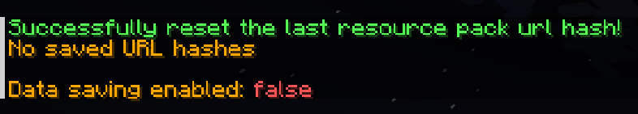

## Remember Url Hashes

### What It Does
This mod helps you avoid re-downloading server resource packs when you already have it.

### Why Is This Mod Needed?
- Vanilla Minecraft tries to avoid re-downloading packs, but if the server doesn't provide a hash, it downloads every time. (Because it can't compare it with a cached copy)
- This mod remembers the hash code of a resource pack based on its URL. (Because it's a property that is surely present)  
- If the URL differs between the pack updates, you won't miss any updates.

### Commands
Alternatively, if the link stays the same between pack updates, or if you suppose that you have an outdated resource pack, you can simply use:  

- `/urlHashesResetAll` to reset all saved hashes  
- `/urlHashesResetLast` to reset the hash for the last loaded pack.  

Additionally, you can use:

- `/urlHashesToggleSaving` to toggle saving the hashes between game sessions. **It's off by default.**  
- `/urlHashesState` to see what's stored in the mod's "hash storage". Useful to figure out what's going on if you're confused.

If you have data saving disabled (**by default**), *everything is stored within the same session*, and if you have saving enabled, *you'll have everything ready across multiple game sessions*, fully minimizing the pack loading downtime.  

### Notes

Fortunately, Fabric allows to have mod working for multiple versions as the same file, so the mod supports 1.21.1 - 1.21.
I don't have plans yet for updating this mod to multiple versions, but you can always check the **source code** and try to update it yourself. I'll soon try to add a good guide for that in the Github "Readme", so you have a good chance of succeeding. If something non-essential breaks, remove it :D  
For anyone wondering, I don't have enough experience to quickly compile for multiple minecraft versions, same for manually updating quickly, and maybe I can just add new good features for a single version before I figure that out.  

### Source Code Guide - Coming Soon
